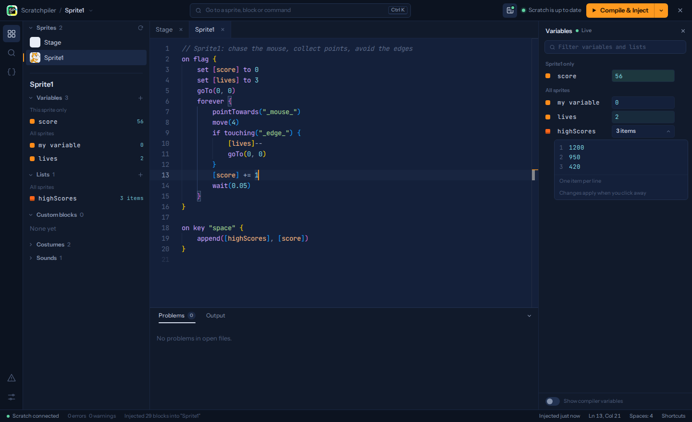

# The Editor

A tour of the overlay you get when you press **Alt+M**. It looks like a desktop IDE because it was built to behave like one: explorer on the left, tabs in the middle, problems at the bottom, variables on the right, and a command palette for people who have given up on the mouse.

*A running project: `score` and `lives` update live on the right, while the code that changes them sits in the middle.*

Everything below has a keyboard shortcut. Hover any button and its tooltip tells you what it is. **Ctrl+/** (outside the editor) shows the whole list.

---

## The top bar

- **Logo menu** — open or save a `.sdsl` file, clear the editor, load an example, read the docs, close the overlay. It's where the old File/Help menus went to retire.
- **The search box** — opens the [command palette](#command-palette). It is not a search box. It is a lifestyle.
- **Variables button** (▦) — toggles the [Variables panel](#the-variables-panel). The little dot on it is green while the project runs, amber at a breakpoint, grey when stopped.
- **Sync indicator** — tells you whether Scratch is running the code you're looking at:
  - **Scratch is up to date** — what's in Scratch matches what's in the editor.
  - **Changed since last inject** — you've edited since you last compiled. Hover it to see which sprites. Their tabs and explorer rows get a dot too.
  - **Not injected yet** — nothing to compare against. Blank slate. Very zen.
- **Compile & Inject** — `Ctrl+Enter`. Shift+click (or `Ctrl+Shift+Enter`) compiles minified, renaming every variable to gibberish for reasons that are between you and your conscience, and leaving the source text out of the project's comments. The arrow next to it also offers **Pull code from Scratch** and **Format document**. When a header is open, the button becomes **Check Header**.

---

## Explorer

`Ctrl+Shift+E`. The left sidebar. Drag its right edge to resize it, `Ctrl+B` to hide it.

**Sprites** lists the Stage and every sprite, with their actual current costume as a thumbnail, because staring at "Sprite1", "Sprite2" and "Sprite3" was never a naming strategy. Each row can show:

- a dot — changed since last inject
- a number — problems found the last time that sprite was open

Click a sprite to open it. Hover it for a **Pull code from Scratch** button. Right-click for everything else (compile, pull, new variable, save as file).

Below the list is the **selected sprite's details**:

- **Variables** and **Lists** — grouped into *This sprite only* and *All sprites*, each showing its live value. Click one to edit it in the Variables panel. The **+** creates a new one right there: type a name, pick the scope, press Enter. No dialog boxes were harmed.
- **Custom blocks** — click to jump to the `define`. The hover button inserts a call at the cursor.
- **Costumes / Backdrops** and **Sounds** — click to insert `switchCostume("…")` or `play("…")` at the cursor, spelled correctly for once.

---

## Tabs

Every sprite and header you open gets a tab. Each tab keeps its own **undo history, cursor and scroll position**, so switching sprites no longer wipes your Ctrl+Z. A dot on a tab means that sprite has changed since the last inject; hover it to reveal the close button anyway.

Middle-click closes a tab. Right-click offers **Close others** and **Close to the right**, for when you've opened eleven sprites and regret all of them. Closing a tab saves it first.

---

## The Variables panel

`Ctrl+Shift+V`, or the ▦ button. It docks on the right and starts closed. Drag its left edge to make it wider.

When the window is too narrow to fit it beside a usable editor, it floats over the code instead of squeezing it.

It shows every variable and list the current sprite can see, and the values are **live**: while the project runs, they update several times a second and flash when they change. This is the closest Scratch will ever get to a debugger watch window, so savor it.

- **Change a value** — click it, type, press Enter (or click away). Escape puts it back.
- **Rename** — click the name and type. Scratchpiler renames it in Scratch *and* rewrites every `[old name]` in your code, then tells you how many references it fixed. Duplicate or empty names are refused, politely. Cloud variables keep their ☁.
- **Edit a list** — click *N items* to expand it into a small editor with one item per line and line numbers down the side. Changes apply when you click away. Lists with more than 10,000 items ask before rendering, because the browser would rather not.
- **Delete** — hover and click the bin, or right-click. A toast offers **Undo**, which brings the variable back with its value.
- **Filter** — the box at the top narrows the list by name.
- **Show compiler variables** — the switch at the bottom reveals the `__`-prefixed helpers the compiler creates for loops, sorts and breakpoints. They're hidden by default because nobody asked to see them.

When the project pauses at a `breakpoint`, an amber bar appears under the top bar, the panel opens by itself, and its status reads **Paused**. The values you see are the values at the moment it stopped. Press **F8** or click **Resume** to carry on.

---

## Command palette

`Ctrl+K`. Type anything and it fuzzy-matches across:

- sprites and headers
- custom blocks, scratchroutines, `on …` scripts, enums and structs in every sprite, including ones you haven't opened (it jumps to the line)
- variables and lists (it opens them in the Variables panel)
- every command in the editor

Prefixes narrow it down:

| Type | To search |
|---|---|
| `>` | commands only (`Ctrl+Shift+P` opens it this way) |
| `@` | sprites and headers only (`Ctrl+P`) |
| `#` | symbols in every sprite only (`Ctrl+T`) |
| `:` | a line number in the current file (`Ctrl+G` outside the editor) |

Arrow keys move, Enter picks, Escape leaves. Note that `Ctrl+K` belongs to the palette now, so Monaco's two-key `Ctrl+K …` shortcuts don't work. We felt this was a fair trade.

---

## Find and replace

`Ctrl+Shift+F`. Searches **every sprite and every header**, including sprites you haven't opened yet (they're decompiled on the fly for the search, not saved). The first search after opening the panel shows "Decompiling…" while that happens; the page stays responsive and the results appear when it finishes.

- **Aa** matches case. **ab** matches whole words only. If nothing is found and one of those is on, the panel says so instead of leaving you to wonder.
- As soon as you type a replacement, every result shows a preview: the old text struck through, the new text next to it.
- **Replace next** only replaces a selection that *exactly* matches the search, then moves to the next match, continuing into other files. It will not replace a whole line just because the match was somewhere inside it. (An earlier version did. We don't talk about it.)
- Hover a result to replace just that one, or hover a file name to replace everything in that file.
- **Replace all** (or `Ctrl+Enter` in the replace box) changes everything at once, then offers **Undo** in a toast.
- Enter in the find box jumps to the next match. Enter in the replace box replaces it.

Every edit in an open file goes through the editor's normal undo, so Ctrl+Z works too.

---

## Problems and Output

The bottom panel. `Ctrl+J` shows or hides it, and dragging its top edge resizes it. Clicking the active tab collapses it; clicking any tab brings it back.

- **Problems** (`Ctrl+Shift+M`) lists every error, warning and hint in **every sprite**, open or not, one line each, grouped by sprite. Groups for sprites you haven't opened start collapsed; the colored counts on the right say what's inside, and clicking the header opens it (it remembers). Click a problem to open that sprite at that spot. **Hints** in the panel's header hides or shows the blue ones. A **Project** group at the end lists variables and lists that nothing uses; clicking one opens it in the Variables panel. The warning icon in the left rail shows the count, and turns red when something is actually broken.
- **Output** is the log: what was injected, pulled, renamed, replaced, or crashed. It only opens itself for errors, so it won't keep popping up to announce that things went fine.

The status bar mirrors the error and warning counts, shows when you last injected, and shows your cursor position. Click the position to jump to a line. **No wrap / Wrap** next to it switches between scrolling long lines sideways and wrapping them (`Alt+Z` does the same).

### Project analysis

The first time you open the overlay, Scratchpiler reads **every sprite**: the ones you have open, the ones saved in this browser, and the rest decompiled from Scratch in the background. A thin orange line runs across the top of the editor and the status bar says *Analyzing Player · 4/12* while it works. The editor stays usable, and the cross-sprite features switch on as soon as it finishes. After that, only the sprite you're editing is re-read as you type. If blocks change in Scratch itself, just those sprites are decompiled again. **Analyze project again** in the palette starts over.

That analysis is what powers broadcast links, `N listeners` hints, cross-sprite references and rename, the project-wide checks and the event flow view. See [code-intelligence.md](code-intelligence.md#across-sprites).

---

## Event flow

The graph icon in the left rail (or **Show event flow** in the palette). It covers the editor with a map of how your scripts start each other, read left to right:

- **Columns.** *Starts* holds the scripts you trigger (green flag, keys, clicks, backdrops, timer). Then come the *Messages* they broadcast, then the scripts those messages run, and so on. Each column says how many scripts or messages it holds.
- **Sprites.** Within a column, each sprite's scripts sit together under its thumbnail and name.
- **Hat blocks.** Scripts are drawn as Scratch hat blocks. Scripts you trigger are amber and bold; scripts started by a message are quieter; `when I start as a clone` is orange and scratchroutines are pink, like their Scratch categories.
- **Messages** are yellow pills. One with several receivers shows how many, and one with three or more is drawn larger, since it's where a lot of the project fans out.
- **Links.** A solid line is `broadcast`, a dashed yellow one is `broadcastAndWait`, and orange links `createClone` to the clone scripts it starts.

Scripts that neither send nor receive anything are listed underneath.

- **Hover** a card or message to light up just its links. **Click** it to keep them highlighted. A panel shows what starts it, what it starts, and which variables it reads and writes (including through custom blocks it calls).
- **Double-click**, or **Open in editor**, to jump to the script.
- **Filter** by sprite, script or message name. **Ctrl+scroll** or the − / + buttons zoom; clicking the percentage fits the graph to the window again.
- **Esc** goes back to the code.

---

## Pull code from Scratch

`Alt+Shift+P`, the compile menu, or the hover button on a sprite. Decompiles the sprite's current blocks into the editor. It's an ordinary edit, so **Ctrl+Z undoes it** if the decompiler's opinions about formatting upset you. Afterwards the sync indicator says Scratch is up to date, because it is.

Sprites with no saved code are decompiled automatically the first time you open them.

Decompiling runs in short slices between the page's own work, so a large sprite doesn't freeze Scratch or the editor. The status bar shows progress, and the editor is read-only until the text arrives (Compile & Inject waits too, so an empty editor can't be injected over your blocks). A single enormous script is still decompiled in one piece, so that one script is the unit of the longest pause.

---

## Headers

The `{ }` icon in the left rail. Headers open in their own tabs next to your sprites. **New** asks for a name inline (`.h` is added if you forget), hover a header to rename or delete it, and right-click for **Find where it's included**. Deleting offers Undo, because headers are shared across every project and deleting the wrong one is a special kind of pain. See [headers.md](headers.md) for what you can put in them.

---

## Settings

`Ctrl+,`, or the sliders icon at the bottom of the left rail.

- **Editor** — theme, font size, indent width, line wrap, minimap, and how soon your code is saved. Long lines scroll sideways by default; turn on **Wrap long lines** (or press `Alt+Z`, or click **No wrap** in the status bar) to wrap them instead. (Earlier versions wrapped by default and saved that choice, so this version resets it once.) Wrapped lines keep their indentation while there's room; in deeply nested code in a narrow editor they start at the left edge instead, so a line never turns into a column a few characters wide.
All compilation uses SLVM automatically. Settings from earlier versions keep editor preferences; the retired backend choice is ignored. See [slvm-backend.md](slvm-backend.md) for the pipeline and verification.
- **Round trip** — **Embed source in comments** (on by default) saves each script's original text in a Scratch comment so Pull code from Scratch can give it back with your formatting and `//` comments. Minified injects never embed it. See [comment-metadata.md](comment-metadata.md).
- **Optimizations** — **Optimize compiled code** (on by default) inlines small custom blocks, unrolls small constant loops inside `warp` blocks, and folds constants. See [slvm-backend.md](slvm-backend.md#optimization), and mark a block `noinline` to opt it out. **Whole-program optimizations** (on by default, and only available while optimization is on) also unrolls small loops in scripts when the project analysis shows no other script can see their variables or interrupt them; see [slvm-backend.md](slvm-backend.md#whole-program-optimization).
- **Checks** — toggle each family of warnings, split into checks within one sprite and **Project checks** across sprites. See [linter.md](linter.md) for what they catch, and [code-intelligence.md](code-intelligence.md) for the smarter ones.
- **Maintenance**:
  - **Re-index project** — rescans sprites, variables and custom blocks when the explorer looks out of date.
  - **Clear saved code** — forgets the code saved in this browser. Sprites are decompiled fresh from Scratch when you open them again.
  - **Remove injected blocks** — deletes everything Scratchpiler injected and clears saved code. It asks you to click twice, because there is no Undo for this one and we would like you to mean it.

Settings live in `localStorage` and survive reloads.

---

## Right-click menus

Almost everything has one:

| Right-click | For |
|---|---|
| The editor | Monaco's own menu (go to definition, rename, format, cut/copy/paste) plus **Compile & inject** and **Pull code from Scratch** |
| A sprite | Open, compile, pull, new variable or list, show variables, save as file |
| A tab | Close, close others, close to the right, compile, save as file |
| A variable or list | Edit, rename, insert at cursor, find all references, delete |
| A custom block | Go to definition, insert a call, find references |
| A header | Open, rename, find where it's included, delete |

Menus work with the arrow keys, and Escape closes them without also closing the whole overlay.

---

## Escape, and other ways to leave

**Esc** closes whatever is on top: a menu, the palette, Search Nowhere, the event flow, or Monaco's own popups (autocomplete, find, rename, hover, the references peek). Only when nothing else is open does it close the overlay. If you're typing in a sidebar field, Escape belongs to that field.

**Alt+M** toggles the overlay from anywhere. Your open tabs and unsaved edits are still there when you come back.

---

## Search Nowhere

Tap **Shift** twice. It searches sprites, code and actions, then presents results from /dev/null and a parallel universe. Some results are real. Some are not. The badges tell you which, which is more honesty than most search engines offer.
